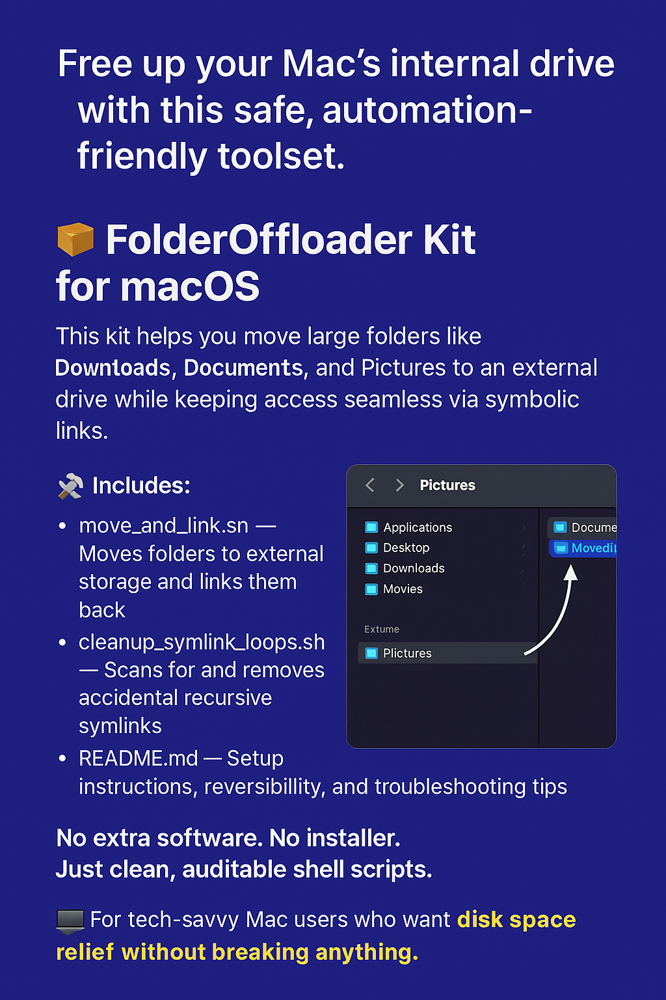

# macos_offloader
Bash tools to move large folders and reclaim SSD space

# 📦 FolderOffloader Kit for macOS



A lightweight, automation-friendly toolset to safely offload large folders (like `Downloads`, `Documents`, and `Pictures`) from your Mac’s internal drive to an external volume — using symbolic links for seamless access.

---

## ✅ Why Use This?

Running out of space on your Mac but don't want to break folder locations or app paths?

This kit helps you:
- Move bulky user folders to an external drive
- Preserve original folder access with symbolic links
- Avoid symlink loops or recursive folder clutter

---

## 📂 What’s Included

| File                         | Description                                      |
|-----------------------------|--------------------------------------------------|
| `move_and_link.sh`          | Main script to move folders + create symlinks    |
| `cleanup_symlink_loops.sh`  | Optional: detects and removes recursive symlinks |
| `README.md`                 | Full setup, usage, and reversal instructions      |

---

## 🚀 How It Works

1. Selects folders in your home directory (`Downloads`, `Documents`, etc.)
2. Moves them to `/Volumes/Storage/moved_<FolderName>`
3. Creates a symbolic link in the original location

Your apps, desktop, and Finder still “see” the folder in the usual place — but the data lives on the external drive.

---

## 🔧 Usage Instructions

### 1. **Prepare Your External Drive**

- Connect your external or secondary drive
- Ensure it’s mounted at `/Volumes/Storage`

You can change the path in the script if needed:
```bash
TARGET_DRIVE="/Volumes/YourDriveName"
```

---

### 2. **Run the Main Script**

```bash
chmod +x move_and_link.sh
./move_and_link.sh
```

This script:
- Skips folders that are already symlinks
- Prevents accidental recursive moves
- Displays clear status messages

---

### 3. **(Optional) Cleanup Symlink Loops**

If you previously ran older versions of the script or manually moved folders and ended up with:
```
moved_Documents/moved_Documents/
```
...you can clean those up with:

```bash
chmod +x cleanup_symlink_loops.sh
./cleanup_symlink_loops.sh
```

You’ll be prompted before anything is deleted. The script only removes nested symlinks — **never actual files or folders**.

---

## 🔄 Reversing the Changes

To undo the offloading:

1. Remove the symbolic link:
```bash
rm ~/Documents
```

2. Move the real folder back:
```bash
mv /Volumes/Storage/moved_Documents ~/Documents
```

Repeat for any other folders.

---

## 🧠 Pro Tips

- Safely re-runnable: the script skips already-handled folders
- Want to move different folders? Just edit the `FOLDERS_TO_MOVE` list in `move_and_link.sh`
- Always test with a dummy folder if you're unsure

---

## 📜 License

MIT License — free to use, modify, and share.

---

## 🙌 Author

Created by a data engineer who needed a no-risk way to offload folders without disrupting workflows.  
This version is cleaned, documented, and ready for everyday use.

---

